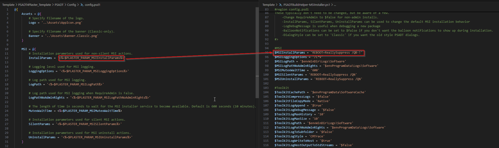
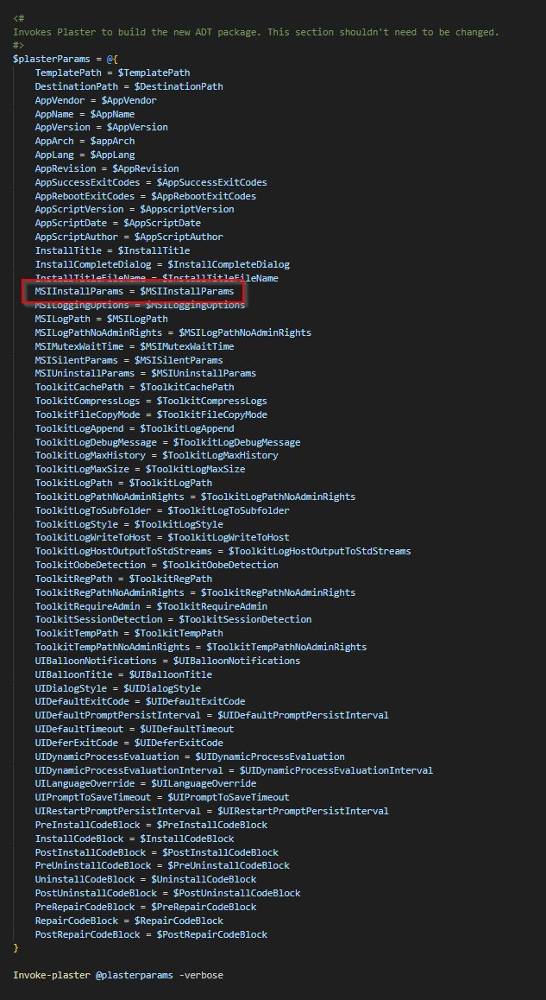
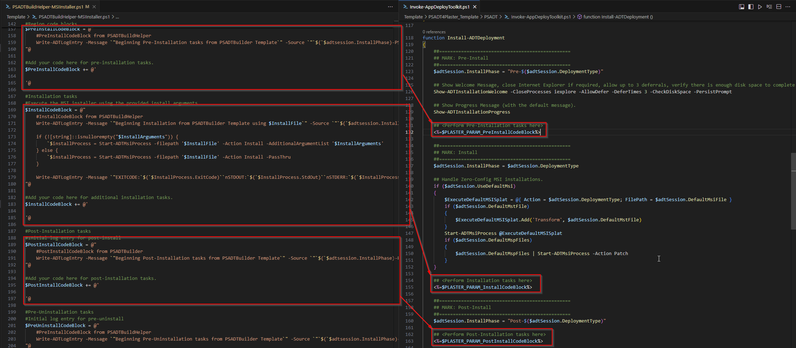

# PSADT4Plaster - 4.1.7
This repo contains a Plaster template for PSADT 4 as well as some "helper" scripts that can be used for building ADT packages.

The goal is to make it easy to standardize app packaging processes and reduce development time. Instead of running New-ADTTemplate and then editing the same values every time, we can build a standardized template with Plaster and reference it instead. This speeds up packaging efforts, but also provides more consistent output.

The template for PSADT version 4.0.6 is included for legacy's sake, but it's recommended to use 4.1.x.

Before using this module, ensure that you're familiar both with the [Powershell App Deploy Toolkit](https://psappdeploytoolkit.com/) and [Plaster module](https://github.com/PowerShellOrg/Plaster).

# How it Works
The included Plaster template will copy the contents of the PSADT and make edits to config.psd1 and Invoke-AppDeployToolkit.ps1 as defined in the Plaster invocation.

All of the configuration options in config.psd1 have been defined in the template and can be easily modified as needed.

Blocks of code for the pre/post install, uninstall and repair actions can be defined that will be passed to invoke-appdeploytoolkit.ps1.

The Plaster module allows us to create a template that is used to replace text in a target file based on parameters that we define.

Let's have a look at the config.psd1 file in the template as an example, specifically the "InstallParams" value in the "MSI" section.

The value assigned to "InstallParams" in config.psd1 has bee replaced with "<%=$PLASTER_PARAM_MSIInstallParams%>"
In the helper script, we assign it's default value, "REBOOT = ReallySuppress /QB-!", to a variable called "$MSIInstallParams"



Further down in the helper script, when we call Invoke-Plaster, we'll set the value of the "MSIInstallParams" parameter to $MSIInstallParams.



The end result is that the Plaster module will replace "<%=$PLASTER_PARAM_MSIInstallParams%>" in config.psd1 with the value assigned to $MSIInstallParams.

The same goes for adding custom code blocks for the install, uninstall and repair phases to Invoke-AppDeployToolkit.ps1. We simply add a Plaster parameter for each phase.



The Install, Uninstall and Repair code blocks all contain pre-populated code that will execute the installers specified in the template automatically using the values provided in the variables in the 'Define Installation Files' region of the template. 

# How to Use it
Inside of this repo, there are two folders. The Template folder contains the Plaster template itself and two "Helper" scripts, which are meant to be copied and then modified as needed. The modified helper script can be kept and updated for future version updates to a given application.

Once a helper script has been customized, it can be easily re-used when future versions of an application are released with minimal changes.

## Example: Package an MSI installer
Create a copy of the PSADTBuildHelper-MSIInstaller.ps1 file and modify it as follows:

#### Ensure that the $TemplatePath variable points to the PSADT4Plaster_Template directory
```powershell
#Specify the path to the plaster template. (Folder that contains PSADT4Plaster.xml and the rest of the template files)
$TemplatePath = "$PSSCRIPTROOT\PSADT4Plaster_Template_4.1.7\"
```

#### Edit the $msifilepath variable to point to the MSI file.
The easiest way to handle this is to put the MSI in the same directory as the helper script. The script will use the Get-ADTMsiTableProperty function to read the properties table in the MSI and populate values such as $AppVendor, $AppName, etc.
```powershell
$msifilepath = "YourInstaller.msi" #Populate with the path to the MSI file that will be used in the ADT package.
```

If more MSI automations are required, such as automating the creation of an MST file or reading/writing other properties, you may want to have a look at one of my other projects, [NativePSMSI](https://github.com/zebulonsmith/NativePSMSI).

#### Edit MSI Installation Properties as needed
Add any additional parameters to pass to the installer. In this example, our installer accepts RemoveDesktopShortcut=True as an additional property. It will be added to the Start-ADTMSIProcess command. If a different executable needs to be launched for uninstall or repair, change the $UninstallFile or $RepairFile variables as needed.
```powershell
#Populate installer files and arguments
$InstallFile = $msifilepath | split-path -leaf #Executable file to install. Be sure it's in the Files directory.
$InstallArguments = "RemoveDesktopShortcut=True"

$UninstallFile = "$($InstallFile)" #This is usually the same as the installation file. Change it if needed.
$UninstallArguments = " "

$RepairFile = "$($InstallFile)" #This is usually the same as the installation file. Change it if needed.
$RepairArguments = " " #This will probably remain empty for an MSI installer. The Repair codeblock will use the built in 'repair' action via Start-ADTMsiProcess.
#endregion
```

#### Run additional Pre and Post actions
There is a herestring for each install phase that can be used to add additional steps to the package. Be wary of single vs double quotes and escape them properly.

Using the Install phase as an example, there is a block of code in double-quotes so that variables from higher up in the build helper script can be referenced and a second herestring utilizing single quotes that's intended to be used for customizations. Add additional code below the "#Add your code here..." comment.
```powershell
#Installation tasks
#Execute the MSI installer using the provided install arguments.
$InstallCodeBlock = @"
    #InstallCodeBlock from PSADTBuildHelper
    Write-ADTLogEntry -Message `"Beginning Installation from PSADTBuilder Template using $InstallFile`" -Source `"`$(`$adtsession.InstallPhase)-PSADTHelper`"

    if (![string]::isnullorempty("$InstallArguments")) {
        `$installProcess = Start-ADTMsiProcess -filepath '$InstallFile' -Action Install -AdditionalArgumentList '$InstallArguments'
    } else {
        `$installProcess = Start-ADTMsiProcess -filepath '$InstallFile' -Action Install -PassThru
    }

    Write-ADTLogEntry -Message `"EXITCODE:`$(`$InstallProcess.ExitCode)``nSTDOUT:`$(`$InstallProcess.StdOut)``nSTDERR:`$(`$InstallProcess.StdErr)" -Source `"`$(`$adtsession.InstallPhase)-PSADTHelper`"
"@

#Add your code here for additional installation tasks.
$installCodeBlock += @'
    #Sample code to copy a file. This code will be copied exactly as-is to invoke-psappdeploytoolkit.ps1

    $SourceFile = "$($ADTSession.DirSupportFiles)\Samplefile.txt"
    $Destination = "$($env:programfiles)\SampleVendor\Samplefile.txt"

    Copy-ADTFile -Path $SourceFile -Destination $Destination
'@
```

#### Execute the Script
Once any additional customizations are made, execute the script. A new PSADT folder structure will be built using the source files in the PSADT4Plaster_Template and the referenced MSI file will be copied to the Files directory.

#### Updating
When a new version of the application is released, simply update the script to reflect the name of the new MSI file (as needed). If install parameters and other customizations remain the same, you can execute the helper script again and it will output an updated PSADT folder structure.

## Example: Package an EXE installer
Packaging an executable installer is similar to an MSI, with a few additional steps. Primarily, because we can't easily read information from within the installer, things like the AppVendor, AppVersion, etc will need to be filled out manually. To begin, create a copy of the PSADTBuildHelper-EXEInstaller.ps1 file and modify it as follows:

#### Configure the Installer File Names
Similar to building from an MSI, the installer must be specified. If a different executable is used for Uninstall or Repair, be sure to change those values. Add any additional arguments

```powershell
#Populate installer files and arguments
$InstallFile = "SampleSetup.exe" #Executable file to install. Be sure it's in the Files directory.
$InstallArguments = "-Install -Silent -NoRestart"

$UninstallFile = "$($InstallFile)" #This is usually the same as the installation file. Change it if needed.
$UninstallArguments = "-Uninstall -Noisy -RestartWithoutWarningBecauseWhyNot "

$RepairFile = "$($InstallFile)" #This is usually the same as the installation file. Change it if needed.
$RepairArguments = " "
```

#### Specify Additional Package Information
With an executable installer, we can't read things like the Publisher and Version so those need to be populated manually. Collectively, as software packagers, we should all publicly shame vendors who don't provide us with MSI installers as a standard practice.

```Powershell
#Populate values in the $adtSession hashtable of Invoke-AppDeployToolkit.ps1
#Note that empty values MUST be populated.

$AppVendor = "VendorName" #Application's publisher.
$AppName = "NotAnMSI" #Application's friendly name.
$AppVersion = "4.3.2" #Application's version number.
$appArch = "x64" #x86 or x64
$AppLang = "EN" #Specify the language code. See PSADT documentation for a list
$AppRevision = "01" #Application revision
$AppSuccessExitCodes = '@(0)' #Exit codes that indicate success. This is typically 0, but some installers may return other codes.
$AppRebootExitCodes = '@(1641, 3010)' #Exit codes that indicate a reboot is required. This is typically 3010, but some installers may return other codes.
$AppscriptVersion = "1.0.0" #Version of this script.
$AppScriptDate = "$(Get-Date -format g)" #Date the script was created
$AppScriptAuthor = "" #Probably you
$InstallTitle = "$($AppVendor) $($AppName) - $($AppVersion)" #Title of the installation. This will be shown in the dialog boxes during installation.
```

#### Complete Other Customizations
Finally, add any custom code as needed using the same process as with an MSI.

# Other Notes
There are many more customization options available in the PSADT and this template does not leverage all of them. Be sure to read the documentation and reference material to determine what other functionality may be appropriate for your situation. This project is meant to be an example and a starting point, not necessarily as a complete solution. That said, it will work for most use cases as-is.